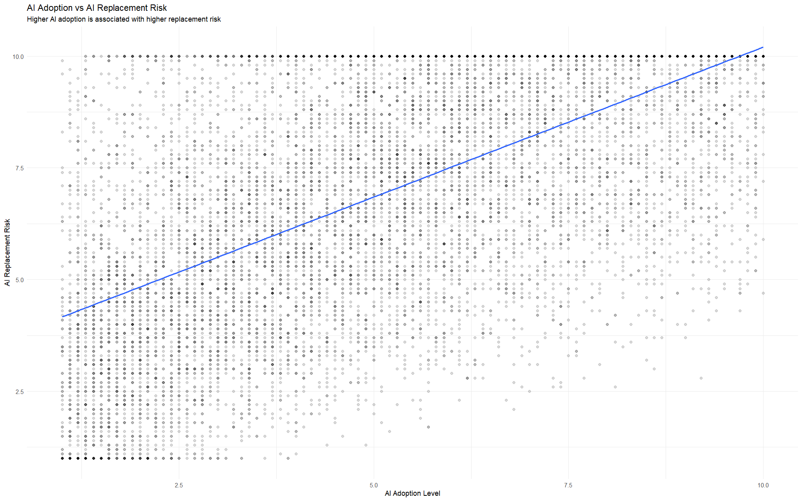
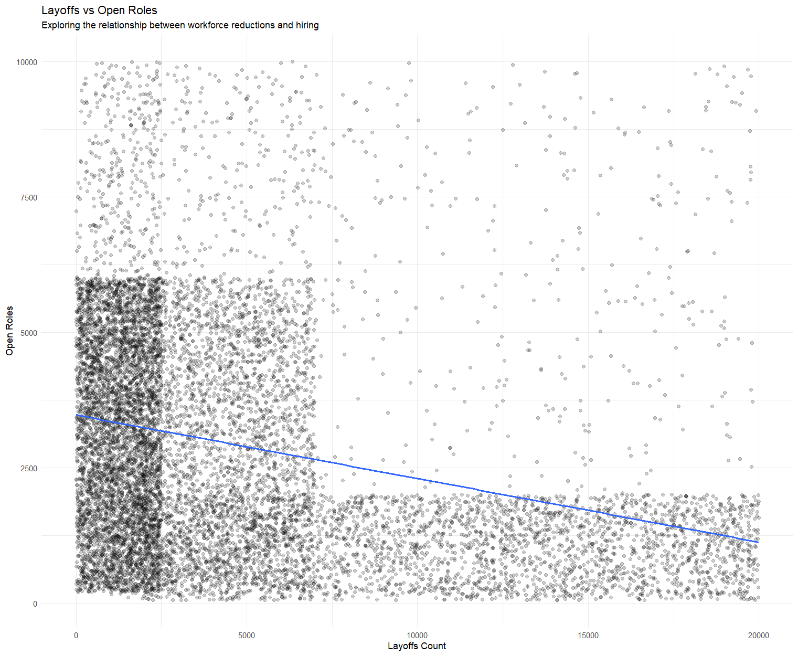
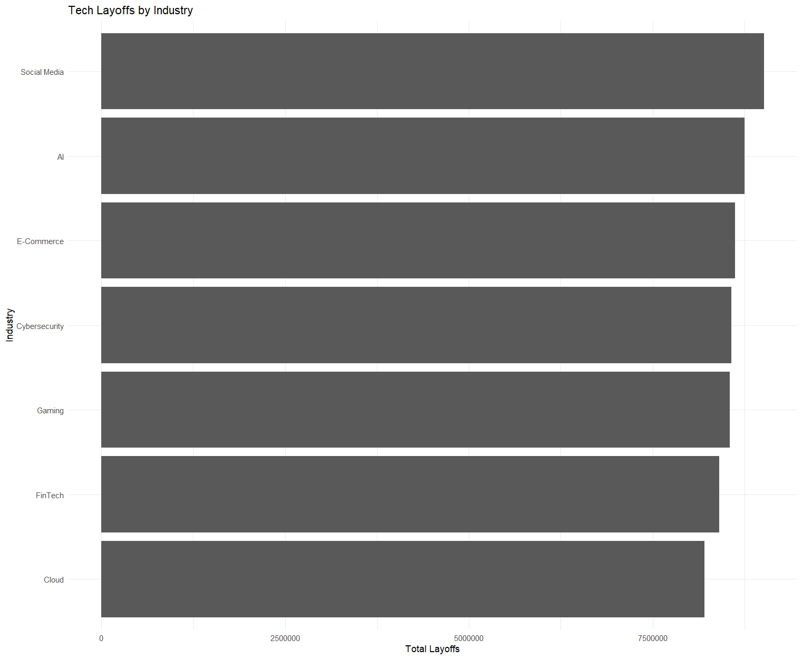

# Tech Layoffs & Hiring Trends Analysis

An R-based exploratory data analysis of tech industry layoffs, hiring trends, and the relationship between AI adoption and AI replacement risk.

## Tools Used

- R
- RStudio
- ggplot2
- dplyr

## Analysis

This project explores:

- AI adoption vs AI replacement risk
- Layoffs vs open roles
- Tech layoffs by industry
- Hiring trends and average layoffs

## Visualizations

### AI Adoption vs AI Replacement Risk

### Layoffs vs Open Roles

### Layoffs by Industry

## Key Findings

- AI adoption showed a positive relationship with AI replacement risk.
- Layoffs and open roles showed a negative relationship in the dataset.
- Social Media recorded the highest total layoffs among the industries analyzed.
- Downsizing had the highest average layoffs per record among the hiring trends.

## Dataset

The analysis uses a dataset containing 12,000 observations and 23 variables related to layoffs, hiring, AI adoption, company characteristics, and market conditions.

Dataset sourced from Kaggle.
The dataset was used for educational and analytical purposes.
